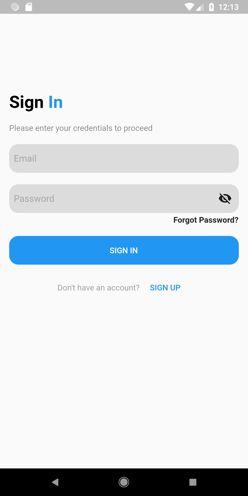
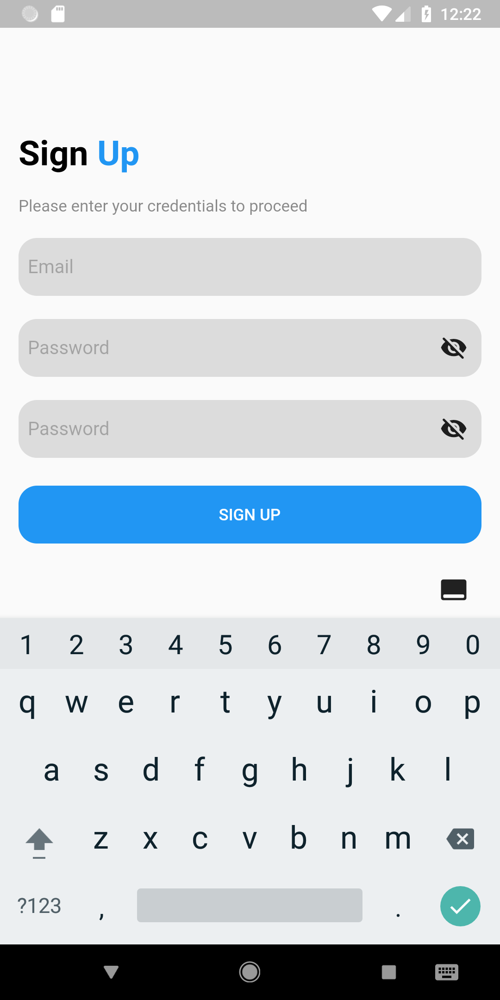
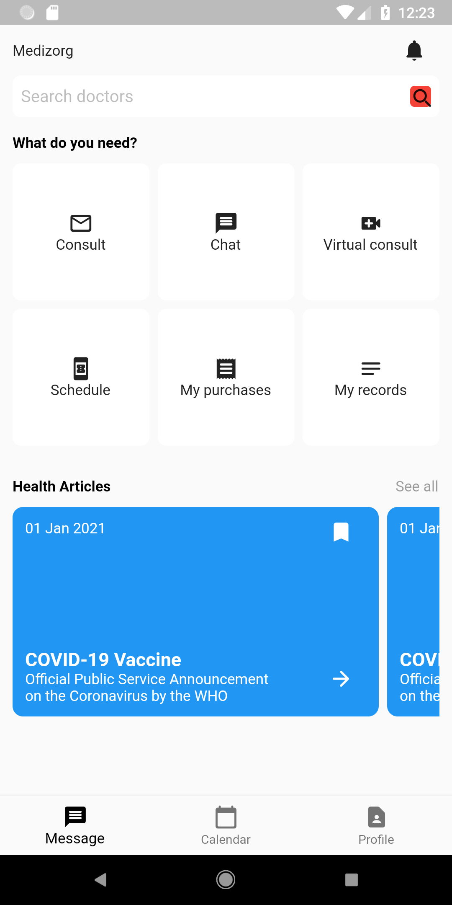

# medizorg

A Flutter project.

## Getting Started
This project(medizorg) is a virtual clinic.

It is a cross-platform app that depends on: 
## ...Firebase Authentication
## ...Flutter http
## ...Agora RTC Engine
## ...Permission Handler

Medizorg is built with the BLoC/provider architectural pattern and it currently has features like
User Authentication, Internet Connectivity and Real-Time Video Chat.

This app is currently in development.

The only screenshots I'm free to disclose are:

